# Create Application Groups 

As explained in the General Hierarchy section, Application Group is a logical grouping of applications installed on session hosts in the host pool. They are of two types: 

1. Remote App 
2. Desktop 

An application group of type ‘Desktop’ was created automatically while creating the Session Host in previous exercise. Now, we will create a new application group of type ‘Remote App’. 

1. In the search bar, search for ‘Windows Virtual Desktop” and you will see a resource that shows up in the same name. Click on it. 

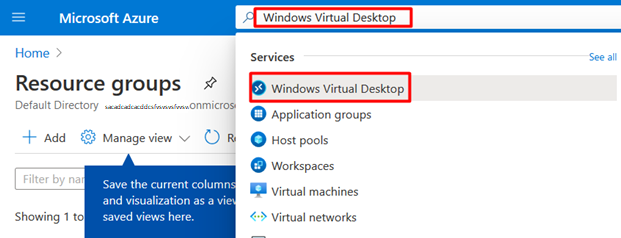

2. You will be directed towards the Windows Virtual Desktop (Hereafter referred as WVD) management window. 

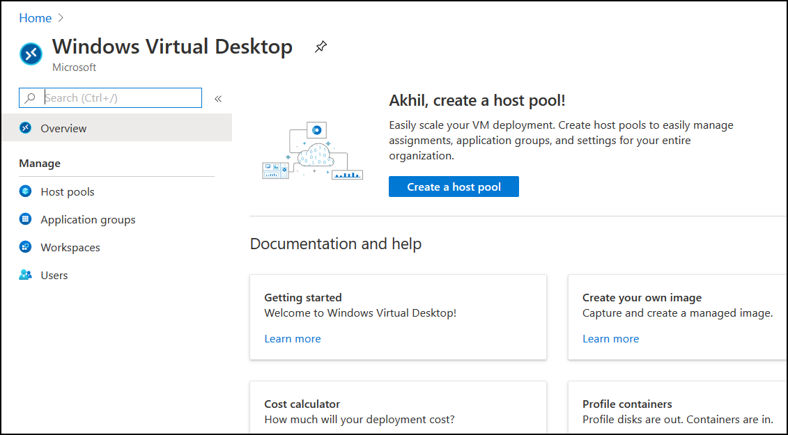

3. Click on the **Application Group** tab. You will see the default Application Group there. Note that the type is ‘Desktop’. Also, it is associated with the Host Pool **WVD-HP-01** we created before and to the workspace **WVD-WS-01**. 

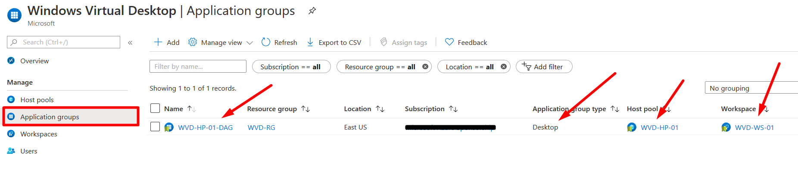

4. Now, lets create a new Application Group of type ‘Remote App’. Click on the **Add** button. 

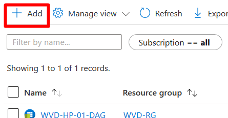

5. On the ‘Basics’ section, fill the parameters as below: 

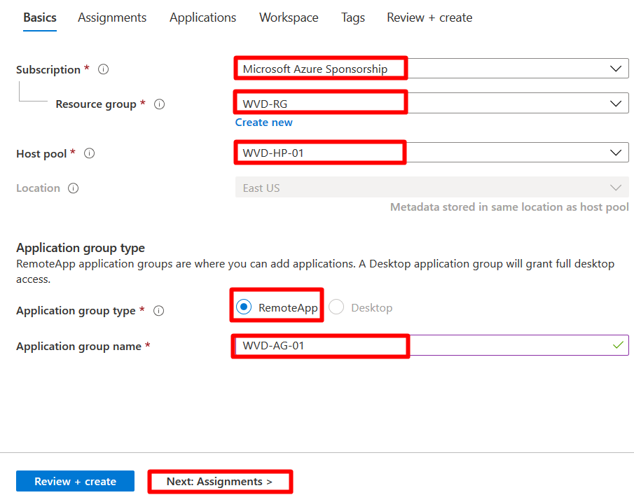

1) **Subscription**: Choose the default subscription

2) **Resource Group**: Choose the default pre-created Resource Group

3) **Host Pool:** WVD-HP-01 

4) **Location**:  Choose the default location

5) **Application Group Type:** RemoteApp 

6) **Application Group Name:** WVD-AG-01 

 

Click on **‘Next:Assignments’**

6. In the assignments section, you can add the user whom should be given access to WVD solution on this application group. Click on the link Add Azure AD users or user groups. 

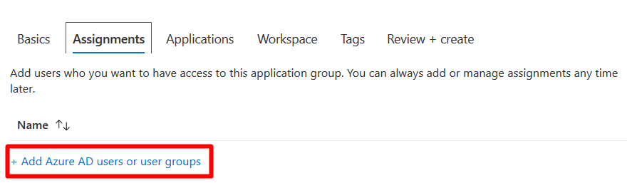

7. In the search box, copy and paste the username given in the ‘Lab Environments’ section in the Lab guide. Click **Select**. 

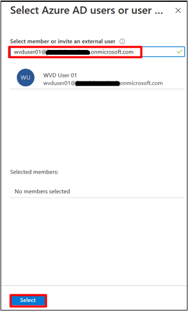

8. Click on **Next:Applications** 

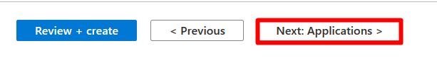

9. On the **Applications** section, click on **Add Applications** to publish applications in the Session Host. 

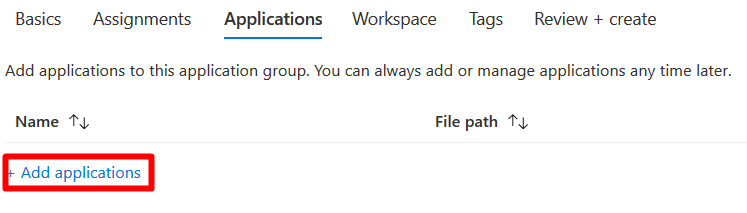

10. In this window, choose the parameters as below: 

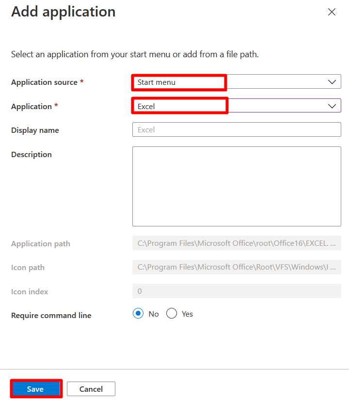

**Application Source:** Start Menu 
**Application:** Excel 

Leave rest of the parameters to be on default settings. 

Click on **Save**. 

11. Click on **Add Application** again. 

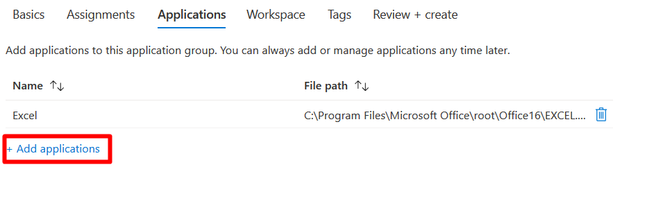

12. Choose the parameters as below: 

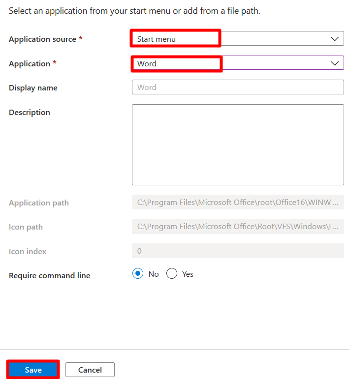

**Application Source:** Start Menu 

**Application:** Word 

Leave rest of the parameters to be on default settings. 

Click on **Save**. 

13. Click on **Next:Workspace**. 

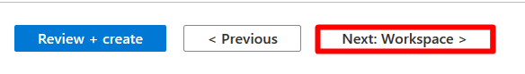

14. In the Workspace section, you choose if the Application Group should be registered or not.  

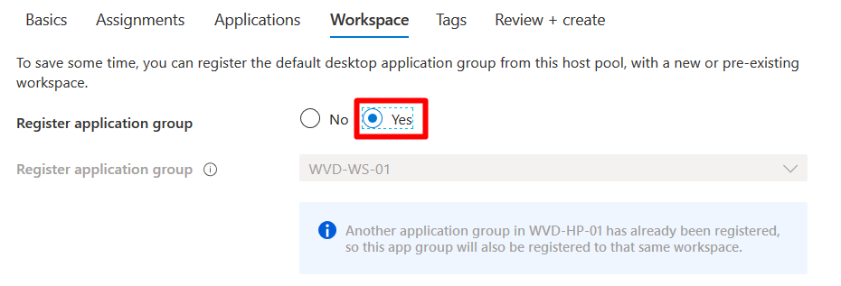

Register Application Group: **Yes **

The Workspace that was created before (**WVD-WS-01**) will be the default, since the default ‘Desktop’ type application group on the same Session Host (**WVD-SH-01**) is registered to this workspace. 

15. Click on **Review + Create**

16. You will get a provision to validate the settings in the validation page. If everything looks correct, click on **Create**. 

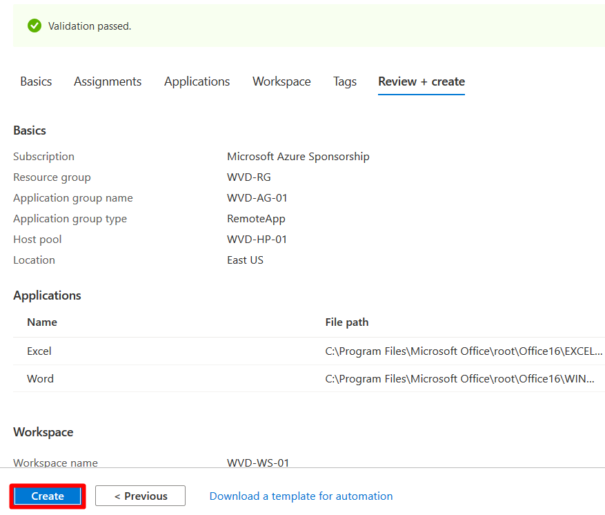

17. Once the deployment is complete, click on **Go to Resource**. 

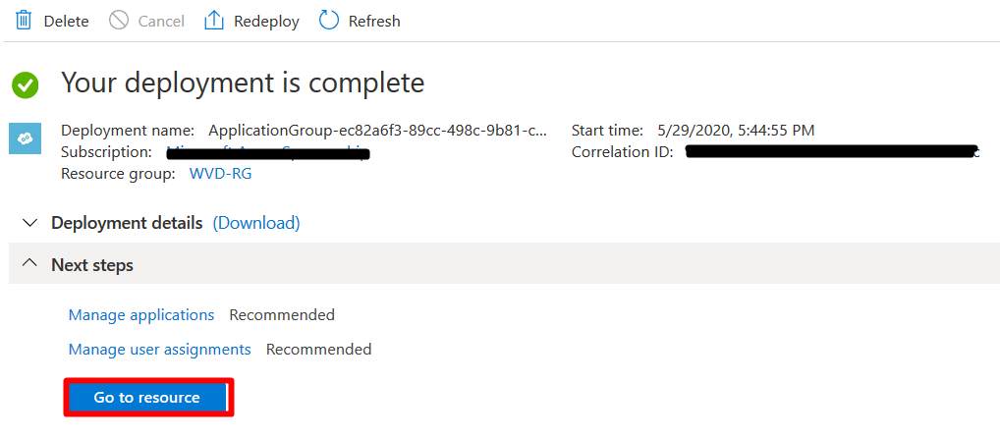

18. In the Application Group Window that comes up, click the Applications menu. 

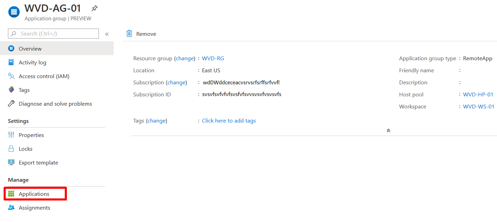

19. You will see that the applications are published in the application Group. 

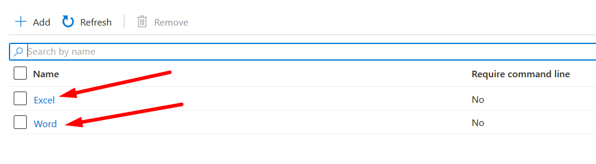

