# Overview 

Windows Virtual Desktop is a multi-tenant service hosted by Microsoft that manages connections between RD clients and isolated Windows Virtual Desktop tenant environments. Each Windows Virtual Desktop tenant environment consists of one or more host pools. Each host pool consists of one or more identical session hosts. The session hosts are virtual machines (VMs) running Windows 10 Enterprise multi-session, Windows Server 2019, Windows Server 2016, Windows 7, and Windows 10 Enterprise. 

 

Each host pool may have one or more app groups. There are two types of app groups: Remote Desktop and Remote App. Remote desktop app group offers access to a full desktop and provides immersive user experience and full interaction with the operating system running on the session host. A Remote App group publishes one or more Remote Apps that display on the Remote Desktop client as the application window on the local Remote Desktop client's desktop. 

## General Hierarchy 

### Hostpools

A host pool is a collection of Azure virtual machines that register to Windows Virtual Desktop as session hosts when you run the Windows Virtual Desktop agent. All session host virtual machines in a host pool should be sourced from the same image for a consistent user experience. 

A host pool can be one of two types: 

1. **Personal**, where each session host is assigned to individual users. 

2. **Pooled**, where session hosts can accept connections from any user authorized to an app group within the host pool. 

You can set additional properties on the host pool to change its load-balancing behavior, how many sessions each session host can take, and what the user can do to session hosts in the host pool while signed in to their Windows Virtual Desktop sessions. You control the resources published to users through app groups. 

### App Groups 

 

An app group is a logical grouping of applications installed on session hosts in the host pool. An app group can be one of two types: 

 

1. **RemoteApp**, where users access the RemoteApps you individually select and publish to the app group 

2. **Desktop**, where users access the full desktop 

By default, a desktop app group (named "Desktop Application Group") is automatically created whenever you create a host pool. You can remove this app group at any time. However, you can't create another desktop app group in the host pool while a desktop app group exists. To publish RemoteApps, you must create a RemoteApp app group. You can create multiple RemoteApp app groups to accommodate different worker scenarios. Different RemoteApp app groups can also contain overlapping RemoteApps. 

 

To publish resources to users, you must assign them to app groups. When assigning users to app groups, consider the following things: 

 

1. A user can be assigned to both a desktop app group and a RemoteApp app group in the same host pool. However, users can only launch one type of app group per session. Users can't launch both types of app groups at the same time in a single session. 

2. A user can be assigned to multiple app groups within the same host pool, and their feed will be an accumulation of both app groups. 

### Workspaces 

A workspace is a logical grouping of application groups in Windows Virtual Desktop. Each Windows Virtual Desktop application group must be associated with a workspace for users to see the remote apps and desktops published to them. 

### End Users 

After you've assigned users to their app groups, they can connect to a Windows Virtual Desktop deployment with any of the Windows Virtual Desktop clients. 

# Pre-requisites to deploy Windows Virtual Desktop

To deploy a Windows Virtual Desktop environment, we need a pre-created domain (e.g: contoso.com) either using a Azure Active Directory Domain Services(AADDS) or by on-premises Active Directory Domain Services (ADDS). In this lab, we have used AADDS and it is pre-provisioned. The Domain name will be available in the Lab Environment Details. Your lab user account is given ‘AAD DC Administrator’ privilege, hence can be used to domain join machines later. 

 # Create Host Pool from Azure Portal 
 
 Host pools are a collection of one or more identical virtual machines within Windows Virtual Desktop environments. Each host pool can contain an app group that users can interact with as they would on a physical desktop. 

1. Login to the Azure portal using the credentials in the Lab Environments section. 

2. In the search bar, search for ‘Windows Virtual Desktop” and you will see a resource that shows up in the same name. Click on it. 

<kbd></kbd>
 

3. You will be directed towards the Windows Virtual Desktop(Hereafter referred as WVD) management window.  

<kbd></kbd>

4. In the management tab, select **Host pools**. 

<kbd></kbd>

5. Click on Add to add new Host Pool. 

<kbd></kbd>

6. Creating a Host Pool is divided into multiple sections. The first one is the Basic section. All the fields in this section are explained below along with the values: 

 <kbd></kbd>
 
 
**A.** Project Details – Defines the environment 

**Subscription**: Choose the default subscription

**Resource Group**: Choose the default pre-created Resource Group

**Host Pool Name**: WVD-HP-01 

**Location**: Choose the location of the pre-created resource Group

**B.** Host Pool Type – Defines the type of host pool. 

1. **Host pool type**: Pooled
 

       Host Pools are of 2 types:
       1.	Pooled
       2.	Personal
       Pooled is used to share the same Session Host (Virtual Machine) resources among multiple users, while Personal uses a dedicated   Session host of individual user.

   
    

    
2. **Max session Limit**: 5

       Max session Limit limits the simultaneous number of users on the same session host.
  
    
   
3. **Load Balancing Algorithm**: Breadth First

       Load Balancing Algorithm are of 2 types:
       1. Breadth-first
       2. Depth-first

       Breadth-first load balancing distributes new user sessions across all available session hosts in the host pool. Depth-first load balancing distributes new user sessions to an available session host with the highest number of connections but has not reached its maximum session limit threshold.
   
   

   
7. In the Virtual machines tab, select **Yes** against **Add virtual machines**. By doing this, we are stepping towards adding Virtual machines to the host pool. 

<kbd></kbd>

8. Now a long list of parameter appears. These can be categorized into three: Session Host specifications, Network and Security, Domain and Administrator account. 

  A. Session Host Specifications 

   In this section, we provide the details of the VMs to be created as session Hosts. 
   
   <kbd></kbd>
   

   **Resource Group**: Choose the default pre-created Resource Group

   **Virtual machine location**: Choose the location of the pre-created resource Group

   **Virtual machine size**: Standard D1_V2 

   **Number of VMs**: 2 
   
   **Name prefix**: WVD-SH 

   **Image type**: Gallery 

   **Image**: Windows 10 Enterprise multi-session, version 1909 + Office 365 ProPlus (choose from dropdown) 

   **OS disk type**: Standard SSD 

   **Use managed disks**: Yes 
   
   
  B. Network and Security 
 
   <kbd></kbd>
   
  
  **Virtual Network**: Default value

  **Subnet**: Default value

  **Public IP**: Default value

  **Network security Group**: Default value

  **Public inbound ports**: Default value
 
 
 c. Domain and Administrator account 

 <kbd> </kbd>
 

   **Specify Domain or Unit**: No 

   **AD domain join UPN**: Provide the username from ‘Lab Environment’ Tab

   **Password**: Provide the password from the ‘Lab Environment’ Tab

   **Confirm Password**: Confirm the password from the ‘Lab Environment’ Tab
   
9. Click on Next:Workspace to proceed. 

10. In the Workspace section, we need to specify if we need to register the default application group with a workspace. 

   <kbd> </kbd>
    
    
**Register desktop app group:** Yes 

**To this workspace:** Create new
    
11.  Once you click the **Create new**, a small window pops up, where you can specify the Workspace name you are going to create.  

<kbd></kbd>

**Workspace name:** WVD-WS-01 
Click **OK** 

12. Once we fill up all the parameters, click on the  **Review + create** button on the bottom left corner. 

<kbd></kbd>

13. The last window helps us verify if the parameters we filled are correct. If yes, click on Create to initiate the deployment. 

<kbd></kbd>

14. The deployment starts, wait until the deployment gets succeeded.  

<kbd></kbd>

<kbd></kbd>
 
 
Click on **Go to Resource**.

15. You will see that the **Hostpool WVD-HP-01** is created with 2 session hosts in it, and a default application group (of type Desktop). 

Click on **Session Hosts** 

<kbd></kbd>

16. Notice the Session Hosts created, with a name concatenating the Name Prefix and increment number. 

<kbd></kbd>

# Create Application Groups 

As explained in the General Hierarchy section, Application Group is a logical grouping of applications installed on session hosts in the host pool. They are of two types: 

1. Remote App 
2. Desktop 

An application group of type ‘Desktop’ was created automatically while creating the Session Host in previous exercise. Now, we will create a new application group of type ‘Remote App’. 

1. In the search bar, search for ‘Windows Virtual Desktop” and you will see a resource that shows up in the same name. Click on it. 

<kbd></kbd>

2. You will be directed towards the Windows Virtual Desktop (Hereafter referred as WVD) management window. 

<kbd></kbd>

3. Click on the **Application Group** tab. You will see the default Application Group there. Note that the type is ‘Desktop’. Also, it is associated with the Host Pool **WVD-HP-01** we created before and to the workspace **WVD-WS-01**. 

<kbd></kbd>

4. Now, lets create a new Application Group of type ‘Remote App’. Click on the **Add** button. 

<kbd></kbd>

5. On the ‘Basics’ section, fill the parameters as below: 

<kbd></kbd>

1) **Subscription**: Choose the default subscription

2) **Resource Group**: Choose the default pre-created Resource Group

3) **Host Pool:** WVD-HP-01 

4) **Location**:  Choose the default location

5) **Application Group Type:** RemoteApp 

6) **Application Group Name:** WVD-AG-01 

 

Click on **‘Next:Assignments’**

6. In the assignments section, you can add the user whom should be given access to WVD solution on this application group. Click on the link Add Azure AD users or user groups. 

<kbd></kbd>

7. In the search box, copy and paste the username given in the ‘Lab Environments’ section in the Lab guide. Click **Select**. 

<kbd></kbd>

8. Click on **Next:Applications** 

<kbd></kbd>

9. On the **Applications** section, click on **Add Applications** to publish applications in the Session Host. 

<kbd></kbd>

10. In this window, choose the parameters as below: 

<kbd></kbd>

**Application Source:** Start Menu 
**Application:** Excel 

Leave rest of the parameters to be on default settings. 

Click on **Save**. 

11. Click on **Add Application** again. 

<kbd></kbd>

12. Choose the parameters as below: 

<kbd></kbd>

**Application Source:** Start Menu 

**Application:** Word 

Leave rest of the parameters to be on default settings. 

Click on **Save**. 

13. Click on **Next:Workspace**. 

<kbd></kbd>

14. In the Workspace section, you choose if the Application Group should be registered or not.  

<kbd></kbd>

Register Application Group: **Yes **

The Workspace that was created before (**WVD-WS-01**) will be the default, since the default ‘Desktop’ type application group on the same Session Host (**WVD-SH-01**) is registered to this workspace. 

15. Click on **Review + Create**

<kbd></kbd>

16. You will get a provision to validate the settings in the validation page. If everything looks correct, click on **Create**. 

<kbd></kbd>

17. Once the deployment is complete, click on **Go to Resource**. 

<kbd></kbd>

18. In the Application Group Window that comes up, click the Applications menu. 

<kbd></kbd>

19. You will see that the applications are published in the application Group. 

<kbd></kbd>

# Access the Published Applications/ Desktop using Browser.
## Access the Published Apps.

Now as we have created Desktop and Apps in previous step, now we will be accessing the Published Apps 

1. Use the link **aka.ms/wvdarmweb** and enter your Credentials to login. 

   <kbd></kbd>
  

2. Now you will be inside the WVD dashboard with all the Desktop and Applications visible. Click on any one of the Applications to access it. 

   <kbd>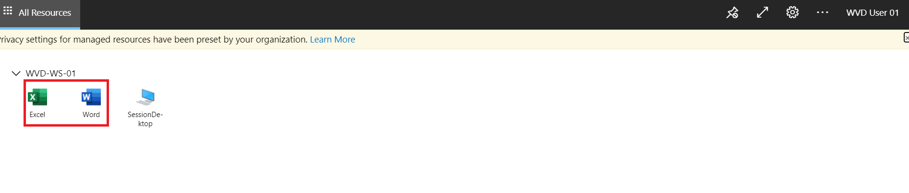</kbd>

3. Click on **Allow** for the Prompt 

   <kbd>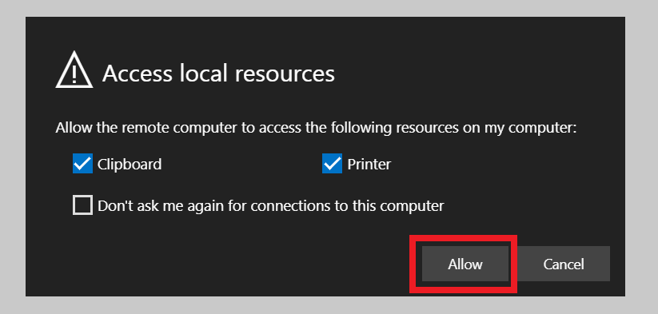</kbd>

4. Enter your **credentials** to access the Application 

   <kbd>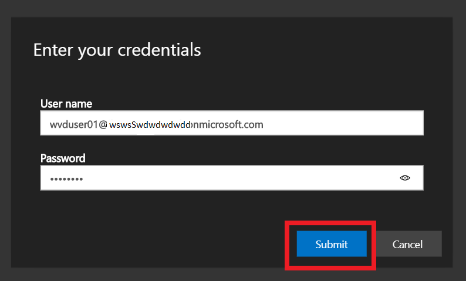</kbd>

5. Your Application will open 

   <kbd>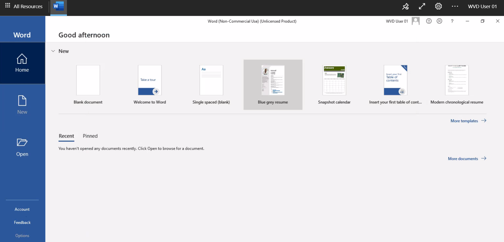</kbd>

## Access the published Desktop.

1. Use the link **aka.ms/wvdarmweb** and enter your Credentials to login. 

   <kbd>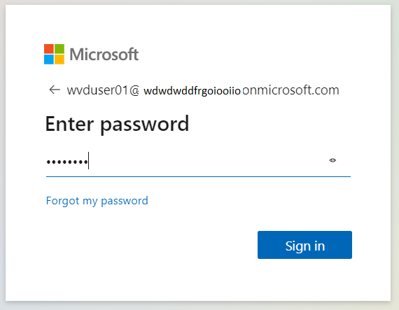</kbd>

2. Now you will be inside the WVD dashboard with all the Desktop and Applications visible. Click on the **Desktop** to access it. 

   <kbd>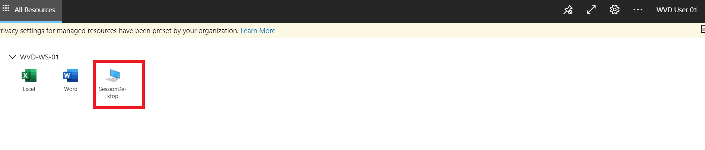</kbd>

3. Click on **Allow** for the Prompt 

   <kbd>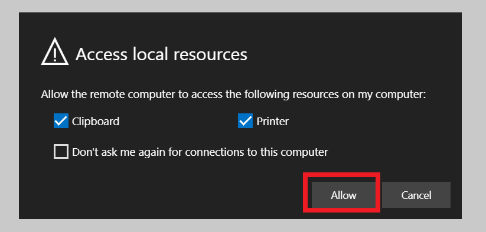</kbd>

4. Enter your **credentials** to access the Application.

   <kbd>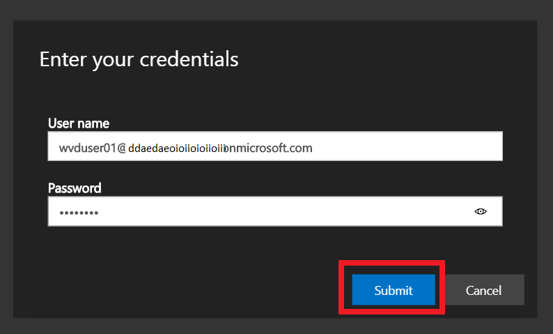</kbd>

5. Your **Desktop Session** will open. 

   <kbd>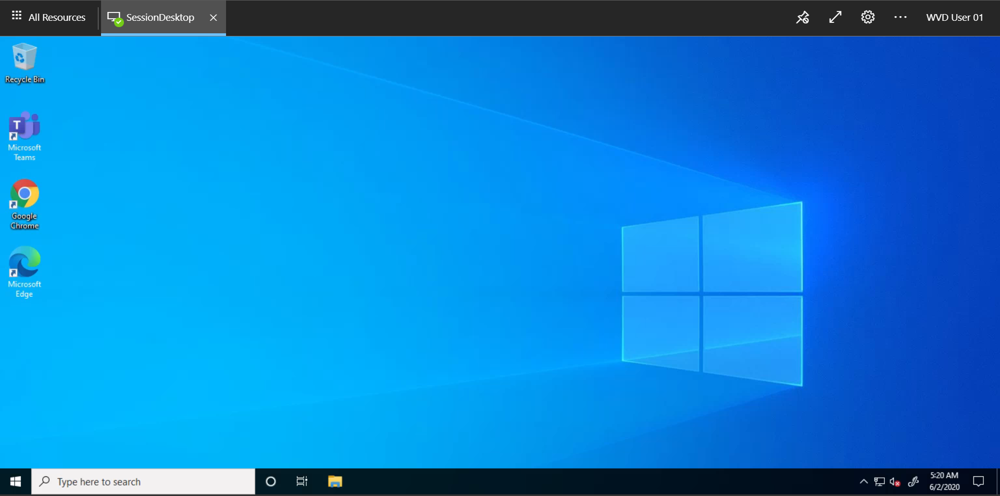</kbd>
   

# Access the Published Applications/ Desktop using WVD Client.

## Access the Published Apps using WVD Client.

1. Download the **WVD Client** on your Local Machine from the Following **Link** and install it.
   **https://docs.microsoft.com/en-us/azure/virtual-desktop/connect-windows-7-and-10**
   
   <kbd>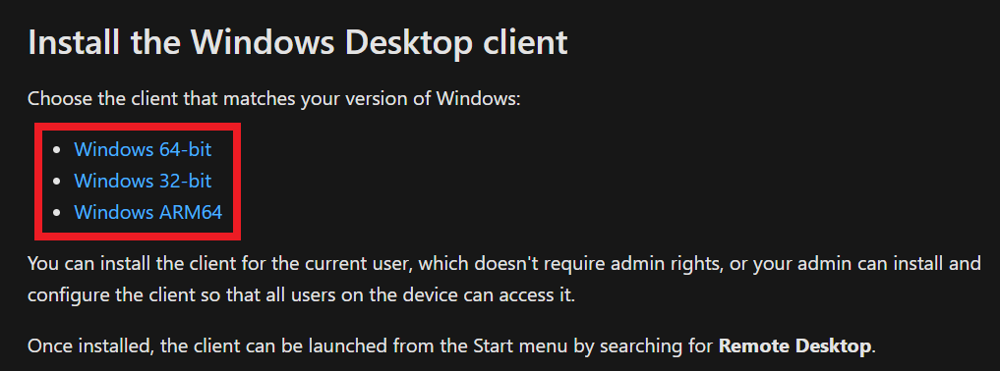</kbd>
   
   
2. After installation, in your Local machine go to **start** and search for **Remote desktop** and open the Application with exact Icon as shown below.

   <kbd>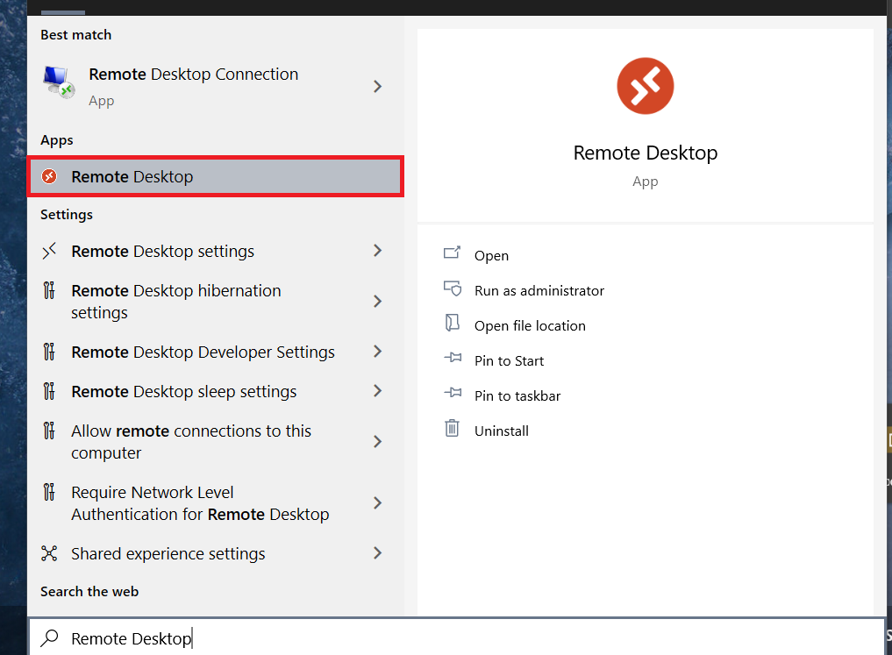</kbd>
   
   
3. After the application opens click on **Subscribe with URL**.

  <kbd>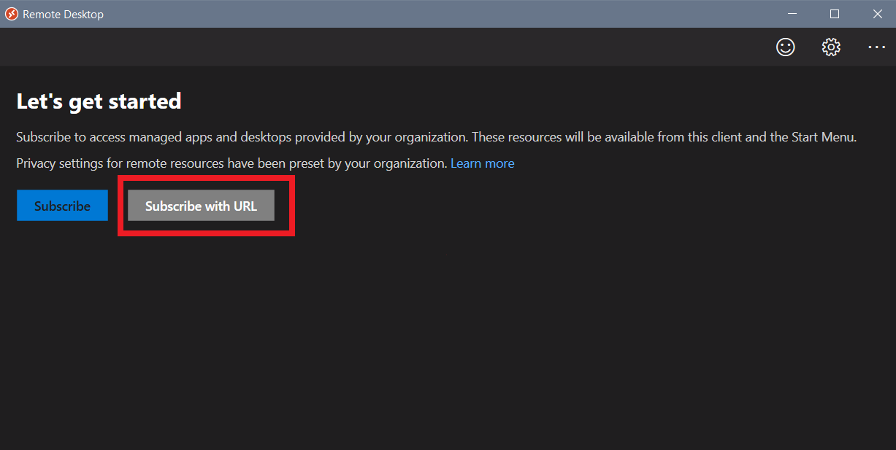</kbd>
  
  
4. Enter the following URL **https://rdweb.wvd.microsoft.com/api/arm/feeddiscovery** and click on **Next**.

   <kbd>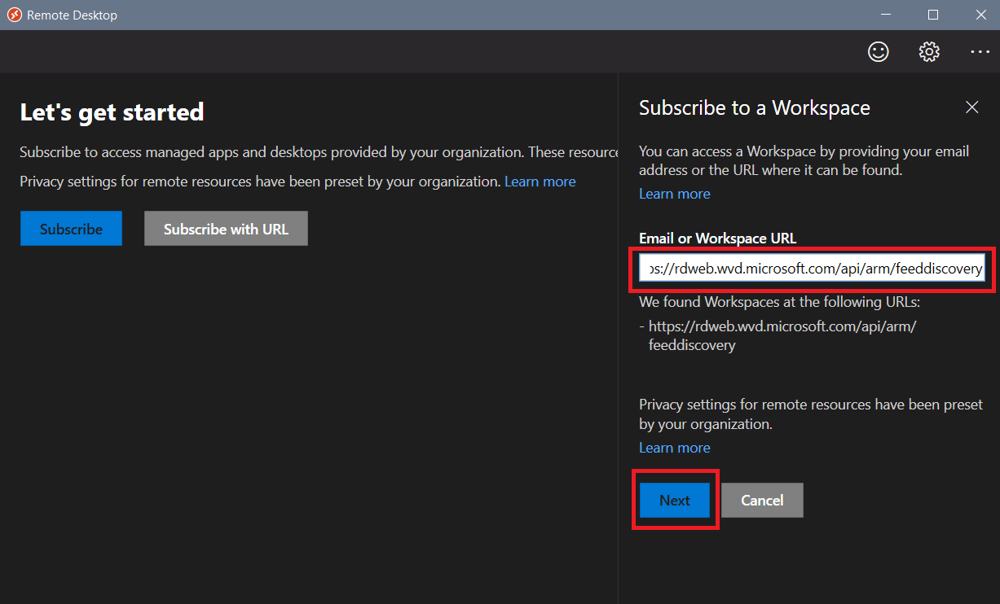</kbd>
   
   
5. Enter your **credentials** to access the Workspace.

   <kbd>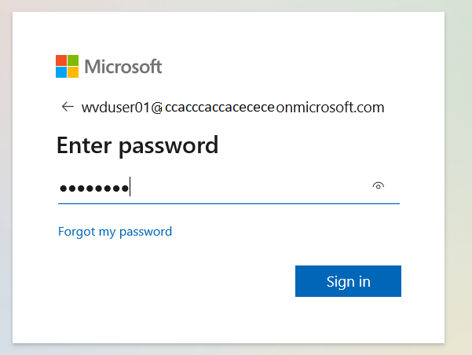</kbd>
   
   
6. Now Click on **Yes** or **This app only** to use your Account as per your need. 

   <kbd>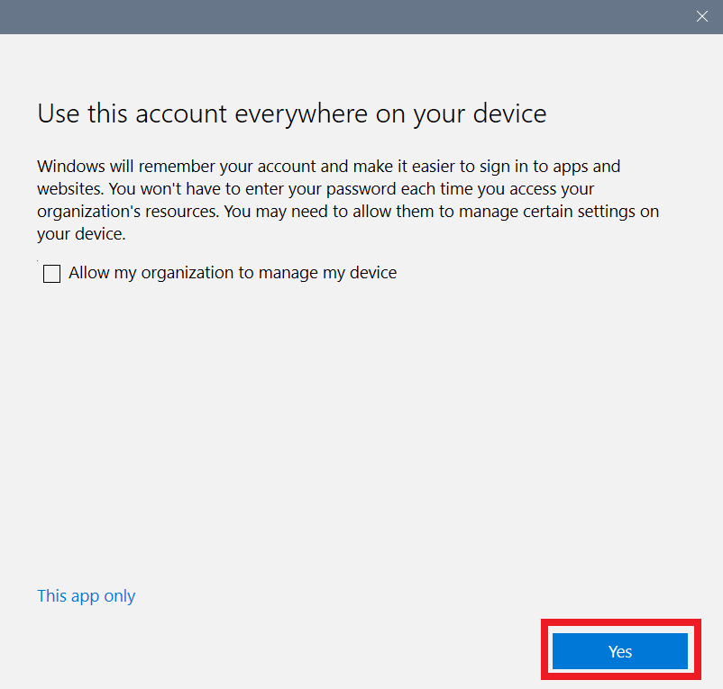</kbd>
   
   
7. Now Click on any of the applications to access it.

   <kbd>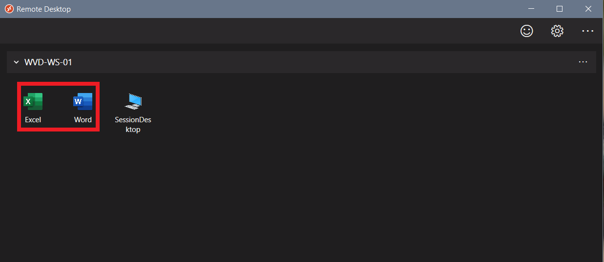</kbd>
   

8. Enter your **credentials** to access the Application.

   <kbd>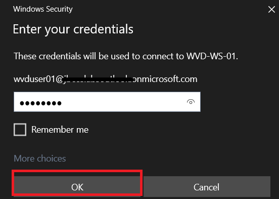</kbd>
   

9. Wait for your Application to connect.

   <kbd>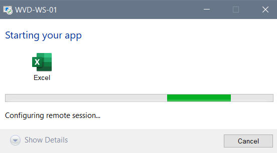</kbd>
   

10. Your Application will open and will be ready to use.

    <kbd>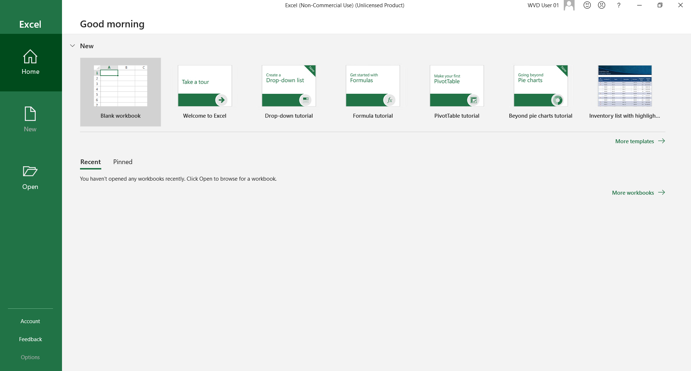</kbd>
    
    

## Access the Workspace Desktop using WVD Client.

1. In your Local machine go to **start** and search for **Remote desktop** and open the Application with exact exact Icon as shown below.

<kbd></kbd>

2. After the application opens click on **Subscribe with URL**.

  <kbd></kbd>
  
  
3. Enter the following URL **https://rdweb.wvd.microsoft.com/api/arm/feeddiscovery** and click on **Next**.

   <kbd></kbd>
   
   
4. Enter your **credentials** to access the Workspace.

   <kbd></kbd>
   
   
5. Now Click on **Yes** or **This app only** to use your Account as per your need. 

   <kbd></kbd>
   
   
6. Now Click on any of the Desktop to access it.

   <kbd>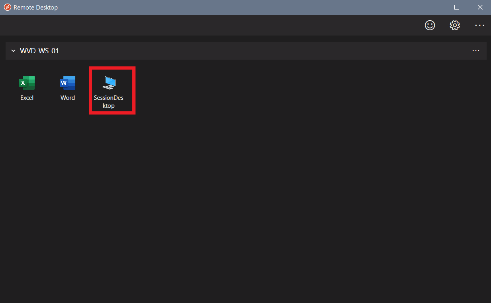</kbd>
   

8. Enter your **credentials** to access the Desktop.

   <kbd>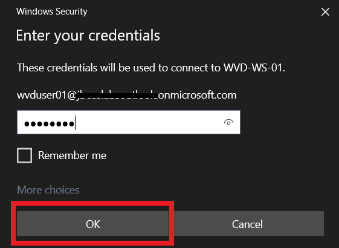</kbd>
   

9. Wait for your Desktop to connect.

   <kbd>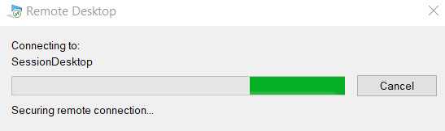</kbd>
   

10. Your Desktop will open and will be ready to use.

        You can also access Aplications through Your Workspace Desktop.
        
     <kbd>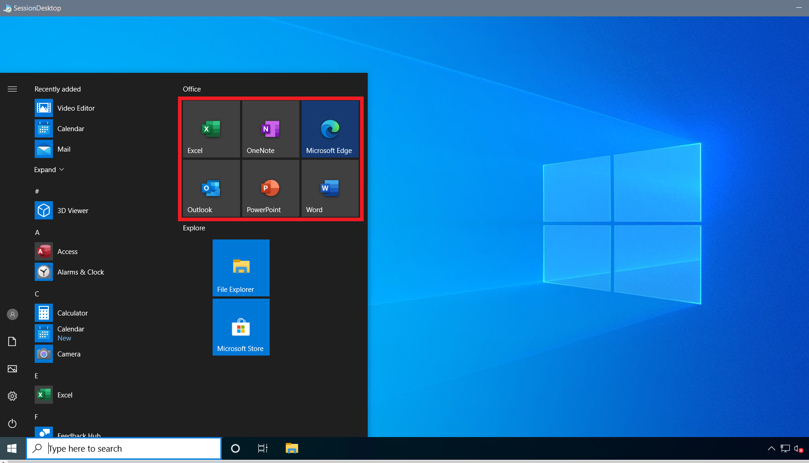</kbd>   
     
    

